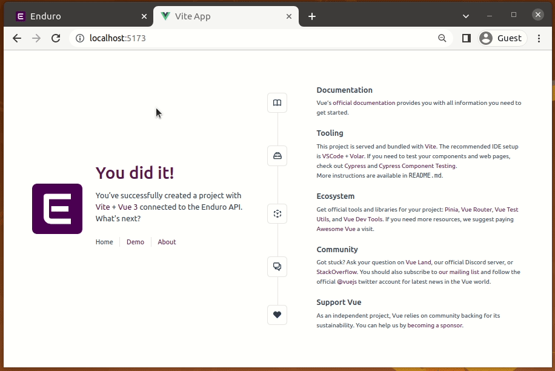

# web-client-example

This template should help get you started developing with Vue 3 in Vite while connecting to the Enduro API.

* The [API specification] was downloaded from the Enduro repo.
* The TypeScript client was generated using [OpenAPI Generator].
* For more Vue configuration details, see [README-vue.md](./README-vue.md).

See the [commit history] if you want to know how this example was built from scratch.

## Demo

[OpenAPI Generator]: https://openapi-generator.tech/
[API specification]: https://github.com/artefactual-sdps/enduro/blob/main/internal/api/gen/http/
[commit history]: https://github.com/artefactual-sdps/web-client-example/commits/main
